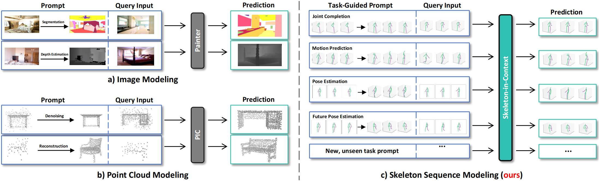

<p align="center">
  <h1 align="center">Skeleton-in-Context: Unified Skeleton Sequence Modeling with In-Context Learning</h1>
  <p align="center">
    CVPR, 2024
    <br />
    <a href="https://github.com/BradleyWang0416/"><strong>Xinshun Wang*</strong></a>
    ·
    <a href="https://github.com/fanglaosi/"><strong>Zhongbin Fang*</strong></a>
    <br />
    <a href="https://xialipku.github.io/"><strong>Xia Li</strong></a>
    ·
    <a href="https://lxtgh.github.io/"><strong>Xiangtai Li</strong></a>
    ·
    <a href="https://www.crcv.ucf.edu/chenchen/"><strong>Chen Chen</strong></a>
    ·
    <a href="https://www.ece.pku.edu.cn/info/1046/2596.htm"><strong>Mengyuan Liu✉</strong></a>
  </p>

  <p align="center">
    <a href='https://arxiv.org/pdf/2312.03703'>
      
    </a>
    <a href='https://bradleywang0416.github.io/skeletonincontext/' style='padding-left: 0.5rem;'>
      
    </a>
  </p>
<br />

This is the official PyTorch implementation of the paper "Skeleton-in-Context: Unified Skeleton Sequence Modeling with In-Context Learning" (CVPR 2024).

<div  align="center">    
 
</div>


# 🙂News
- [Apr 23, 2024] Code is released.
- [Feb 27, 2024] Paper is accepted by CVPR 2024!
- [Dec 07, 2023] Paper is released and GitHub repo is created.


# 😃Run

## 1. Installation
```
conda create -n skeleton_in_context python=3.7 anaconda
conda activate skeleton_in_context
pip install -r requirements.txt
```

## 2. Data Preparation

There are 2 ways to prepare data:

### 1) Download ready-to-use data

You can download ready-to-use data [here](https://drive.google.com/drive/folders/1NYsgUGdHzWFK_OPwVUm-cl8y-T1Q4MWG?usp=sharing), and unzip the files in ```data/```.
After you do so, the ```data/``` directory should look like this:

```
data/
│
├── 3DPW_MC/
│   ├── train/
│   └── test/
│
├── AMASS/
│   ├── train/
│   └── test/
│
├── H36M/
|   ├── train/
|   └── test/
│
├── H36M_FPE/
|   ├── train/
|   └── test/
|
├── source_data/
|   └── H36M.pkl
|
└── support_data/
```

Now you are ready to train and evaluate Skeleton-in-Context.

### 2) Download source data and pre-process them

**Human3.6M**:

Download MotionBERT's Human3.6M data [here](https://1drv.ms/u/s!AvAdh0LSjEOlgU7BuUZcyafu8kzc?e=vobkjZ), unzip to `data/source_data/`, and rename it `H36M.pkl`. Please refer to [MotionBERT](https://github.com/Walter0807/MotionBERT/blob/main/docs/pose3d.md) for how the Human3.6M data are processed.

**AMASS**:

Download AMASS data [here](https://amass.is.tue.mpg.de/). The AMASS data directory should look like this:

```
data/source_data/AMASS/
├── ACCAD/
├── BioMotionLab_NTroje/
├── CMU/
├── EKUT/
├── Eyes_Japan_Dataset/
├── KIT/
├── MPI_Limits/
├── TCD_handMocap/
└── TotalCapture/
```

**3DPW**:

Download 3DPW data [here](https://virtualhumans.mpi-inf.mpg.de/3DPW/). The 3DPW data directory should look like this:

```
data/source_data/PW3D/
└── sequenceFiles/
    ├── test/
    ├── train/
    └── validation/
```

**Pre-process**:

Pre-process the data by running the following lines:

```
python data_gen/convert_h36m_PE.py
python data_gen/convert_h36m_FPE.py
python data_gen/convert_amass_MP.py
python data_gen/convert_3dpw_MC.py
python data_gen/calculate_avg_pose.py
```

Now you are ready to train and evaluate Skeleton-in-Context.


## 3. Training
To train Skeleton-in-Context, run the following command:

```
CUDA_VISIBLE_DEVICES=<GPU> python train.py --config configs/default.yaml --checkpoint ckpt/[YOUR_EXP_NAME]
```

## 4. Evaluation
To evaluate Skeleton-in-Context, run the following command:
```
CUDA_VISIBLE_DEVICES=<GPU> python train.py --config configs/default.yaml --evaluate ckpt/[YOUR_EXP_NAME]/[YOUR_CKPT]
```
For example:
```
CUDA_VISIBLE_DEVICES=<GPU> python train.py --config configs/default.yaml --evaluate ckpt/pretrained/latest_epoch.bin
```


# License
MIT License

# Citation
If you find our work useful in your research, please consider citing: 
```
@article{wang2023skeleton,
  title={Skeleton-in-Context: Unified Skeleton Sequence Modeling with In-Context Learning},
  author={Wang, Xinshun and Fang, Zhongbin and Li, Xia and Li, Xiangtai and Chen, Chen and Liu, Mengyuan},
  journal={arXiv preprint arXiv:2312.03703},
  year={2023}
}
```

# Acknowledgement

This work is inspired by [Point-In-Context](https://github.com/fanglaosi/Point-In-Context/). The code
for our work is built upon [MotionBERT](https://github.com/Walter0807/MotionBERT).
Our tribute to these excellent works, and special thanks to the following works: [siMLPe](https://github.com/dulucas/siMLPe), [EqMotion](https://github.com/MediaBrain-SJTU/EqMotion), [STCFormer](https://github.com/zhenhuat/STCFormer), [GLA-GCN](https://github.com/bruceyo/GLA-GCN).
