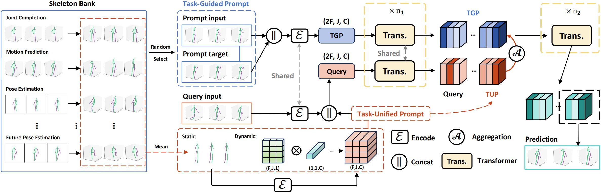
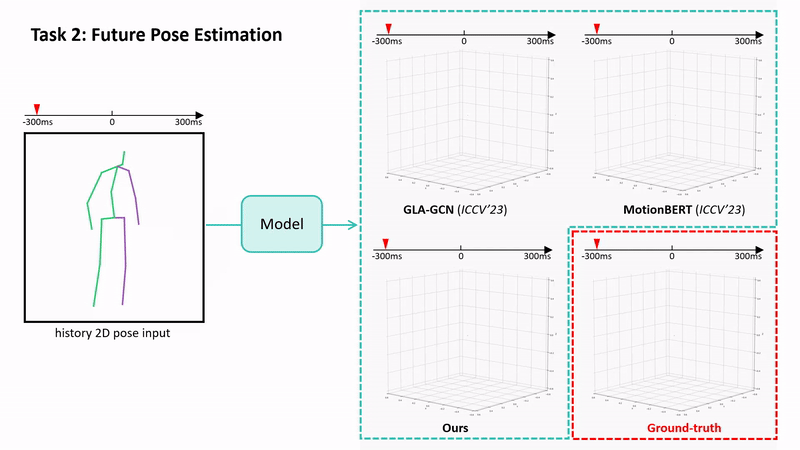
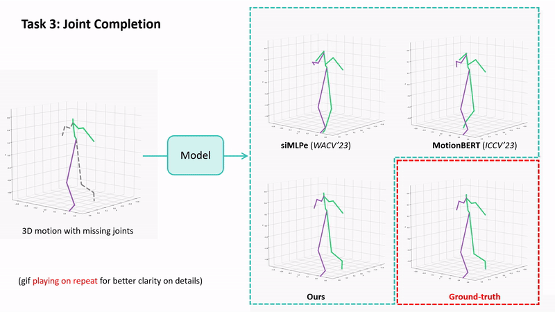
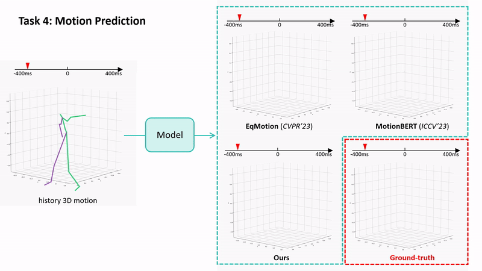
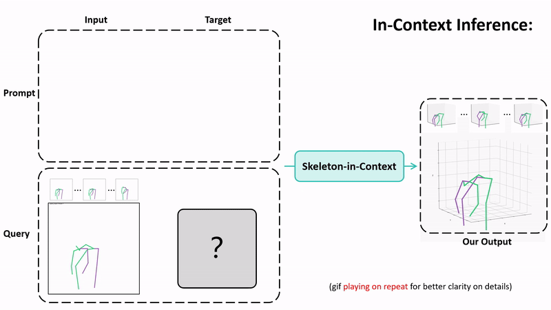
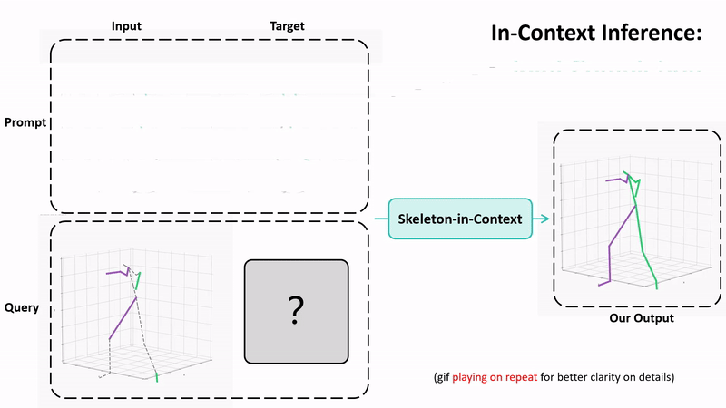
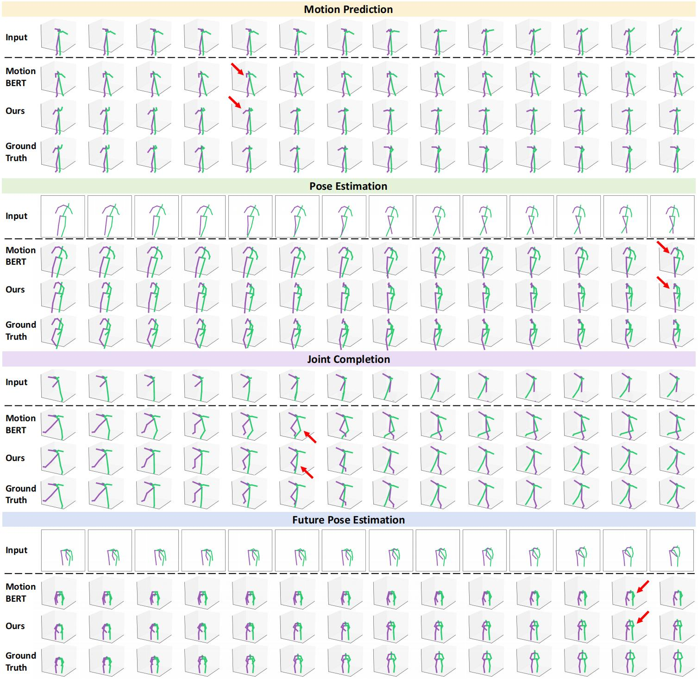
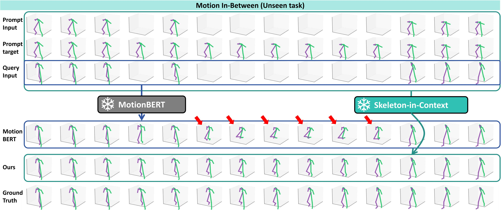

<br />
<p align="center">
  <h1 align="center">Skeleton-in-Context: Unified Skeleton Sequence Modeling with In-Context Learning</h1>
  <p align="center">
    CVPR, 2024
    <br />
    <a href="https://github.com/BradleyWang0416/"><strong>Xinshun Wang*</strong></a>
    ·
    <a href="https://github.com/fanglaosi/"><strong>Zhongbin Fang*</strong></a>
    ·
    <a href="https://xialipku.github.io/"><strong>Xia Li</strong></a>
    ·
    <a href="https://lxtgh.github.io/"><strong>Xiangtai Li</strong></a>
    <br />
    <a href="https://www.crcv.ucf.edu/chenchen/"><strong>Chen Chen</strong></a>
    .
    <a href="https://www.ece.pku.edu.cn/info/1046/2596.htm"><strong>Mengyuan Liu✉</strong></a>
  </p>

  <p align="center">
    <a href='https://arxiv.org/abs/2312.03703'>
      
    </a>
    <a href='https://bradleywang0416.github.io/skeletonincontext/' style='padding-left: 0.5rem;'>
      
    </a>
  </p>
<br />

❗❗❗ Our work is the **_first_** to explore in-context learning for unifying skeleton sequence modeling.


In-context learning in **(a)** image modeling, **(b)** point cloud modeling, and **(c)** skeleton sequence modeling (ours).

## ☀️Abstract

In-context learning provides a new perspective for multi-task modeling for vision and NLP.
Under this setting, the model can perceive tasks from prompts and accomplish them without any extra task-specific head predictions or model finetuning.
However, Skeleton sequence modeling via in-context learning remains unexplored.
Directly applying existing in-context models from other areas onto skeleton sequences fails due to the inter-frame and cross-task pose similarity that makes it outstandingly hard to perceive the task correctly from a subtle context.
To address this challenge, we propose Skeleton-in-Context (SiC), an effective framework for in-context skeleton sequence modeling. Our SiC is able to handle multiple skeleton-based tasks simultaneously after a single training process and accomplish each task from context according to the given prompt. It can further generalize to new, unseen tasks according to customized prompts.
To facilitate context perception, we additionally propose a task-unified prompt, which adaptively learns tasks of different natures, such as partial joint-level generation, sequence-level prediction, or 2D-to-3D motion prediction.
We conduct extensive experiments to evaluate the effectiveness of our SiC on multiple tasks, including motion prediction, pose estimation, joint completion, and future pose estimation. We also evaluate its generalization capability on unseen tasks such as motion-in-between. These experiments show that our model achieves state-of-the-art multi-task performance and even outperforms single-task methods on certain tasks.

## ✋Skeleton-in-Context



**Overall framework of our Skeleton-in-Context**. Specifically, we establish a skeleton bank by integrating training sets under different tasks, which contain a large amount of input-target pairs performing different tasks. Next, we randomly select a sample pair as the task-guided prompt (TGP) and a query input from the skeleton bank, undergo encoding, and concatenating, respectively, and then input them into the transformer in parallel. In particular, during this process, the query input and task-unified prompt (TUP) are combined to form a new query. After iterating n1 times, the TGP and query are aggregated through aggregation function and then input into the transformer for n2 iterations. Lastly, the second half of the model output is used as our prediction.

## ⚡Features

### 1. In-context learning for unifying skeleton sequence modeling

- The first work to explore the application of in-context learning in skeleton sequences.
- A new framework for tackling multiple tasks (four tasks), which outperforms other multi-task-capable models.
- Skeleton-in-Context solves the overfitting problem that is encountered when using the masked-modeling-style training framework of existing methods.

### 2. New benchmark for skeleton-based multi-tasking

- A new multi-task benchmark for evaluating the capability of processing multiple skeleton-based tasks, including motion prediction, pose estimation, joint completion, and future pose estimation.

### 3. Impressive performance and strong generalization capability

- Surpasses other multi-task-capable models re-structured from multi-stage models or task-specific models.
- Surpasses even task-specific models (siMLPe, EqMotion, STCFormer, GLA-GCN, MotionBERT) on some tasks.
- Skeleton-in-Context can generalize to new datasets well, and perform unseen tasks when given customized prompts.

## 😃Visualization

### 1. In-context demo
In-context inference demo, including pose estimation, future pose estimation, joint completion, and motion prediction.

   

### 2. Generalization capability
Our SiC can perform ❗**unseen tasks**❗ on the **same query sample** by customizing task-guided prompts.

For a query sample belonging to pose estimation, SiC is able to predict and estimate future 3D motion according to the customized prompt.



SiC can perform the motion in-between task (unseen) when we provide a prompt whose frames are partially masked.




### 3. Comparison of visualization with [MotionBERT](https://motionbert.github.io/)
We visualize and compare the results of our SiC and the most recent SoTA model, MotionBERT, which is re-structured as an end-to-end multi-task model for fair comparison. As highlighted in the following figure, our SiC can generate more accurate poses than MotionBERT according to the provided task-guided prompt (existing prompts or unseen prompts in the training set).





## ⬜Code

**The code will be released upon the acceptance of the submission.**

## Citation
If you think Skeleton-in-Context is helpful to your research, please consider citing Skeleton-in-Context:
```
@article{wang2023skeleton,
  title={Skeleton-in-Context: Unified Skeleton Sequence Modeling with In-Context Learning},
  author={Wang, Xinshun and Fang, Zhongbin and Li, Xia and Li, Xiangtai and Chen, Chen and Liu, Mengyuan},
  journal={arXiv preprint arXiv:2312.03703},
  year={2023}
}
```
